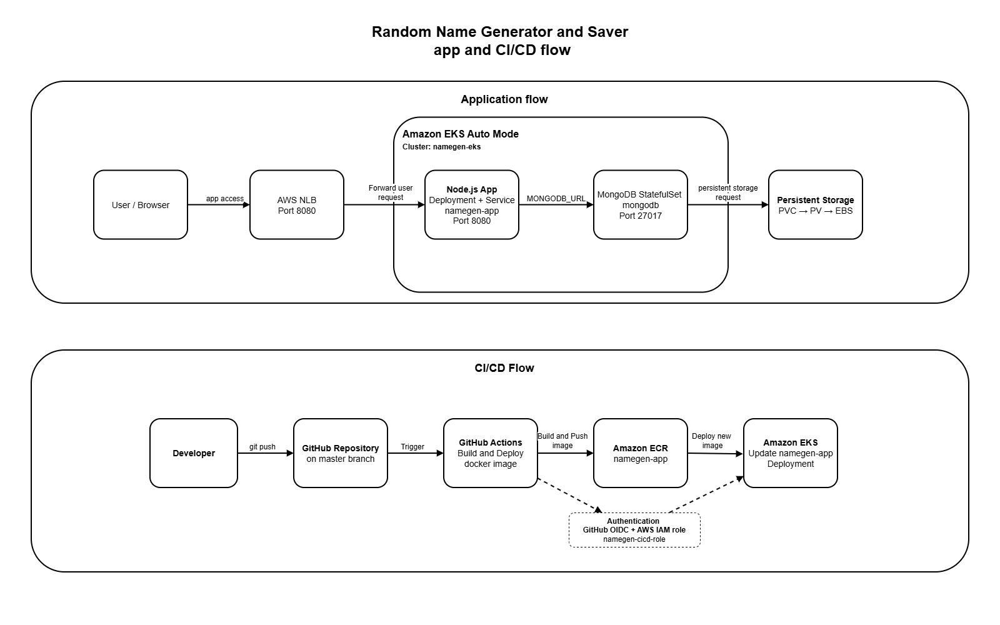

# Random Name Generator and Saver App - EKS with CI/CD

## Overview

This project deploys a **Node.js Random Name Generator and Saver app** to **Amazon EKS Auto Mode**.

The app can:

- Generate random names
- Save names to MongoDB
- Display previously saved names

The app is containerized with Docker, stored in **Amazon ECR**, deployed to **Amazon EKS**, and exposed through an **AWS NLB (Network Load Balancer)**.

A **GitHub Actions** workflow automatically builds and deploys a new app image whenever code is pushed to the `master` branch.

You can see the original app source code here:  
https://github.com/redhat-developer-demos/namegen

---

## Main Components

- **Node.js** - web app and API
- **MongoDB 3.6** - app database
- **Docker** - app container

- **Amazon ECR** - Docker image registry
- **Amazon EKS Auto Mode** - Kubernetes cluster
- **eksctl** - EKS infrastructure provisioning
- **PersistentVolume / Amazon EBS gp3** - persistent MongoDB storage
- **AWS NLB** - exposes the app to the internet

- **Kubernetes Deployment** - runs the Node.js app
- **Kubernetes StatefulSet** - runs MongoDB

- **GitHub Actions** - CI/CD pipeline
- **GitHub OIDC + AWS IAM** - secure CI/CD authentication

---

## Architecture



### App Flow

```text
User / Browser
      |
      v
AWS Network Load Balancer (port 8080)
      |
      v
Kubernetes Service
(namegen-app-service)
      |
      v
Node.js Deployment
(namegen-app)
      |
      v
MongoDB Service (port 27017)
      |
      v
MongoDB StatefulSet
      |
      v
PersistentVolumeClaim
      |
      v
PersistentVolume
      |
      v
Amazon EBS (gp3)
```

## CI/CD

On every push to `master`, GitHub Actions:

1. Checks out the repository
2. Authenticates to AWS using OIDC
3. Builds the Docker image
4. Tags it with the Git commit SHA
5. Pushes it to the `namegen-app` ECR repository
6. Connects to the `namegen-eks` cluster
7. Updates the `namegen-app` Kubernetes Deployment
8. Waits for the rollout to complete

---

### CI/CD Flow

```text
Push to 'master' branch
      |
      v
GitHub Actions
      |
      +--> GitHub OIDC --> AWS IAM Role
      |
      +--> Build Docker Image
              |
              v
          Amazon ECR
              |
              v
          Amazon EKS
              |
              v
      Updated app Deployment
```

GitHub Actions uses **OIDC** to assume the AWS IAM role `namegen-cicd-role`, so no long-lived AWS access keys are stored in GitHub.

Each Docker image is tagged with the Git commit SHA (for it to be unique) before being pushed to ECR.

---

## Repository Structure

```text
.
├── .github/
│   └── workflows/
│       └── deploy.yml
│
├── Kubernetes/
│   ├── app_deployment.yaml
│   ├── app_service.yaml
│   ├── mongodb_init_configmap.yaml
│   ├── mongodb_service.yaml
│   ├── mongodb_statefulset.yaml
│   └── storage_class.yaml
│
├── eksctl/
│   └── eks_cluster.yaml
│
├── diagram/
│   └── architecture.png
│
├── screenshots/
│   └── running_app.png
│
├── data/
├── public/
│
├── .dockerignore
├── .gitignore
├── Dockerfile
├── LICENSE
├── logger.js
├── package.json
├── package-lock.json
├── server.js
└── README.md
```

---

## Deployment

### 1. Create the EKS Cluster

```bash
eksctl create cluster -f eksctl/eks_cluster.yaml
```

Configure `kubectl`:

```bash
aws eks update-kubeconfig --region eu-central-1 --name namegen-eks
```

Verify the cluster:

```bash
kubectl get nodes
```

### 2. Deploy MongoDB and Persistent Storage

```bash
kubectl apply -f Kubernetes/storage_class.yaml
kubectl apply -f Kubernetes/mongodb_init_configmap.yaml
kubectl apply -f Kubernetes/mongodb_service.yaml
kubectl apply -f Kubernetes/mongodb_statefulset.yaml
```

MongoDB runs as a StatefulSet using the `mongo:3.6` image.

The StatefulSet requests **1Gi** of persistent storage using the `mongodb-storage` StorageClass and Amazon EBS `gp3`.

### 3. Deploy the app

```bash
kubectl apply -f Kubernetes/app_deployment.yaml
kubectl apply -f Kubernetes/app_service.yaml
```

The app runs as the `namegen-app` Deployment and is exposed on port `8080` through the AWS NLB.

Verify the deployment:

```bash
kubectl get pods
kubectl get services
kubectl get pvc
kubectl get pv
```

---

## Persistence Verification

You can verify MongoDB persistence by:

1. Saving names through the running app
2. Deleting the MongoDB Pod:

```bash
kubectl delete pod mongodb-0
```

3. Waiting for the StatefulSet to recreate the Pod
4. Refreshing the app

If the previously saved names remain available, it confirms that MongoDB data is stored persistently on the Persistent Volume rather than inside the Pod.

---